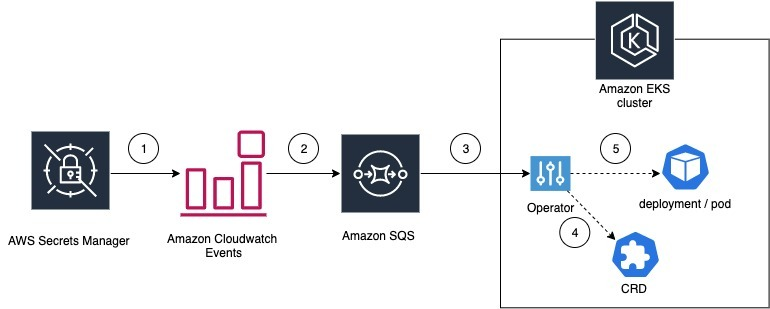

# Introduction
This project helps users to automatically redeploy the pods running on Amazon EKS cluster when the secrets in AWS Secerets Manager is rotated. When the pods are restarted, webhook in our previous [blog](https://aws.amazon.com/blogs/containers/aws-secrets-controller-poc/) will retrive the latest secret and mount it onto the pods.



## Pre-requisites

* Install Kubebuilder from the [official documentation](https://book.kubebuilder.io/quick-start.html#installation)
* The controller components are written in Go language. Ensure you have [go installed](https://golang.org/doc/install) in your system
* [Kustomize](https://kubernetes-sigs.github.io/kustomize/installation/)
* [AWS Account](https://aws.amazon.com/) with sufficient access privileges to create resources such as Amazon SQS queue, EventBridge rule

## Deploying the operator along with the CRD

EKS Operator for automatic secrets rotation can be deployed following the series of steps outlined below:

1. Clone the github repo into the project path:

    ```
    git clone https://github.com/aws-samples/aws-secret-sidecar-injector && cd secretoperator
    ```

2. We need an AWS EventBridge Rule which captures the AWS Secret Manager secrets update API calls and publishes them to an Amazon SQS queue. The secrets controller reads these events and responds by restarting the corresponding Deployment. We have included a CloudFormation template in the repo which creates all of these AWS resources for us. 

    Once the resources are created, we create the CRD resources which maps the Kubernetes deployment names to the AWS Secrets Manager secret name. 

    Run the following make command to complete this setup.

    ```
    make install
    ```

    This setup also deploys the controller on the cluster using the     registry image - amazon/aws-secrets-manager-secret-rotator.

## Testing the solution

Now that we have deployed all the building blocks required, let’s test the operator. 

1. Create a sample CRD and deployment in the default namespace.

    In this example we’re going to create a CRD which maps the secret     eks-controller-test-secret to a deployment named nginx. 

    ```
    make test_operator
    ```

    When the controller detects any update calls on this secret id, it will     scan for all the deployments with the matching labels and restart the     deployment pods which will allow them to pick up the new secret value.    In this case, the nginx pods with the label  environment: operatortest    will be restarted

2. In order to see the controller re-deploy the deployment pods, create a PutSecretValue event either by changing the secret sqssecret value in console or with the below CLI call

    ```
    aws secretsmanager put-secret-value --secret-id eks-controller-test-secret --secret-string testsqssec:newsecret
    ```

    We can verify from the pod logs that the new secret is successfully updated by running the following command.

    ```
    kubectl logs -n secretoperator-system $(kubectl get po -n secretoperator-system -o=jsonpath='{.items[*].metadata.name}') -c manager -f
    ```

    Sample output.

    ```
    Secret ID rotated eks-controller-test-secret
    Rotating deployment operatortest
    DeleteMessageBatchList output: {
      Successful: [{
          Id: "22211be0-aaaa-bbbb-cccc-733a1ff7bd17"
        }]
    }
    2021-03-08T20:43:25.715Z    DEBUG    controller-runtime.controller        Successfully Reconciled    {"controller": "secretsrotationmapping",     "request": "default/secretsrotationmapping-sample"}
    ```

    Alternatively, you can pass the watch option to list the sample deployment pods and observe the restart. 

    ```
    kubectl get pods --selector environment=operatortest --watch
    ```

    Sample output.  

    ```
    NAME                            READY   STATUS    RESTARTS   AGE
    operatortest-8569978555-cl76n   1/1     Running   0          5s
    operatortest-54cd7d5795-6r72c   0/1     Pending   0          0s
    operatortest-54cd7d5795-6r72c   0/1     Pending   0          0s
    operatortest-54cd7d5795-6r72c   0/1     ContainerCreating   0          0s
    operatortest-54cd7d5795-6r72c   1/1     Running             0          2s
    operatortest-8569978555-cl76n   1/1     Terminating         0          37s
    operatortest-8569978555-cl76n   0/1     Terminating         0          38s
    operatortest-8569978555-cl76n   0/1     Terminating         0          39s
    operatortest-8569978555-cl76n   0/1     Terminating         0          39s
    ```

## Cleaning up

To clean up all the provisioned resources to test this solution, run the below command.

```
make delete
```

The output should look like - 
```
echo "Cleaning up the k8s and aws resources..."
Cleaning up the k8s and aws resources...
kubectl delete -f config/samples/deployment.yaml
deployment.apps "operatortest" deleted
kubectl delete -f config/samples/awssecretsoperator_v1_secretsrotationmapping.yaml
secretsrotationmapping.awssecretsoperator.secretoperator "secretsrotationmapping-sample" deleted
kustomize build config/default | kubectl delete -f -
namespace "secretoperator-system" deleted
customresourcedefinition.apiextensions.k8s.io "secretsrotationmappings.awssecretsoperator.secretoperator" deleted
serviceaccount "secretoperator-operator-serviceaccount" deleted
role.rbac.authorization.k8s.io "secretoperator-leader-election-role" deleted
clusterrole.rbac.authorization.k8s.io "secretoperator-manager-role" deleted
clusterrole.rbac.authorization.k8s.io "secretoperator-proxy-role" deleted
clusterrole.rbac.authorization.k8s.io "secretoperator-metrics-reader" deleted
rolebinding.rbac.authorization.k8s.io "secretoperator-leader-election-rolebinding" deleted
clusterrolebinding.rbac.authorization.k8s.io "secretoperator-manager-rolebinding" deleted
clusterrolebinding.rbac.authorization.k8s.io "secretoperator-proxy-rolebinding" deleted
service "secretoperator-controller-manager-metrics-service" deleted
deployment.apps "secretoperator-controller-manager" deleted
aws cloudformation delete-stack --stack-name EKS-Secrets-Operator-Stack
aws cloudformation wait stack-delete-complete --stack-name EKS-Secrets-Operator-Stack
make init
cp config/manager/kustomization_bkup.yaml config/manager/kustomization.yaml
cp config/manager/manager_bkup.yaml config/manager/manager.yaml
rm config/manager/*.bak
```

## Troubleshooting steps

1. How to check if the secretoperator is running

    Check if there is a deployment `secretoperator-controller-manager` in the namespace `secretoperator-system` and make sure the pod in the deployment is ready.

    ```
    kubectl get pods -n secretoperator-system
    ```

2. How to check the controller logs 

    ```
    kubectl logs -c manager -l control-plane=controller-manager -n secretoperator-system
    ```

3. How to fix the issue if the secretoperator pod logs are showing Access Denied errors

    * Make sure the OIDC identity provider is created as per the [IRSA guidelines.](https://aws.amazon.com/blogs/opensource/introducing-fine-grained-iam-roles-service-accounts/)

    * Make sure the OperatorRole created by CloudFormation stack in step 4 has the correct trust policy . 

    ```
    {
      "Version": "2012-10-17",
      "Statement": [
        {
          "Effect": "Allow",
          "Principal": {
            "Federated": "arn:aws:iam::XXXXXXX:oidc-provider/<OIDC_PROVIDER>"
          },
          "Action": "sts:AssumeRoleWithWebIdentity",
          "Condition": {
            "StringEquals": {
              "<OIDC_PROVIDER>:sub": "system:serviceaccount:secretoperator-system:secretoperator-operator-serviceaccount"
            }
          }
        }
      ]
    }
    ```

    * Make sure the OIDC ID in the trust policy is for the EKS cluster on which the operator is running

4. What to check if the pods in the deployment / daemonset / statefulset are not getting restarted after secret is updated?

    * Check the CRD resource and make sure the secret you are updating the secret ID in the resource is same -

    ```
    kubectl get SecretsRotationMapping secretsrotationmapping-sample -o yaml
    ```

    * Make sure the label in the CRD resource and label in the Deployements/Daemonsets/Statefulset mathc. Labels are    case sensitive.

## Result - 
The secrets-nginx deployment should restart the pods

